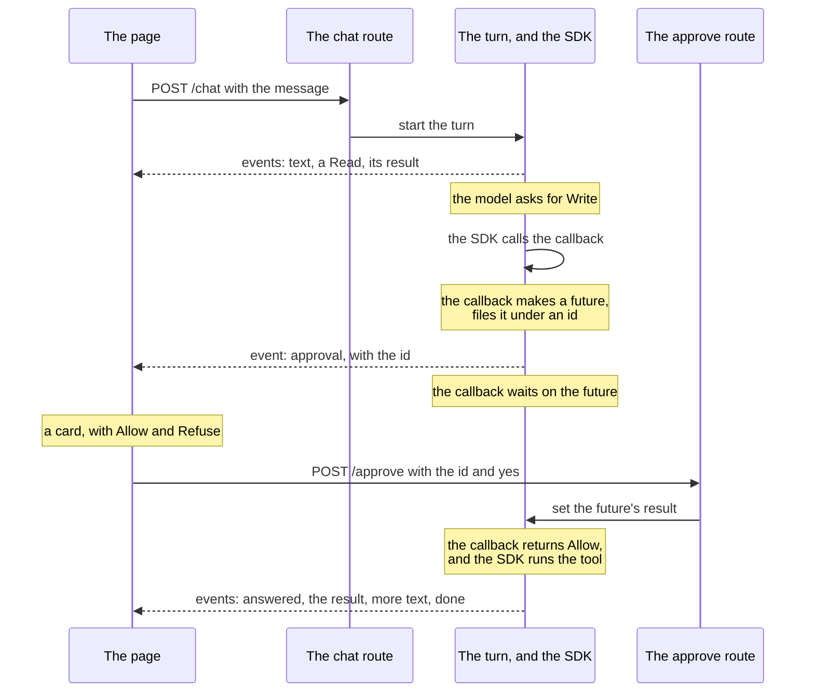

# One approval

A turn in which the agent asks to write a file, and the person in the
chat says yes. Time runs down the page.

- Two requests from the page are open at once. The first, to `/chat`,
  is the stream the reply is arriving on. The second, to `/approve`,
  is short: it carries the answer and ends.

- The future is what joins them. The callback awaits it inside the
  turn, and the approve route completes it from outside.

- While the callback waits, the turn waits. Nothing is sent to the
  model, and nothing is charged, until the answer comes or the time
  runs out.
