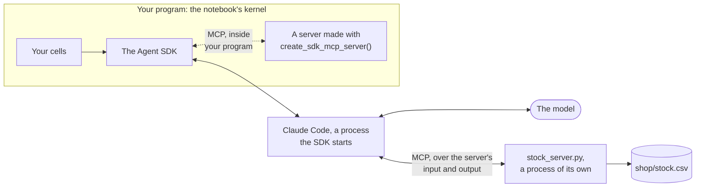

# Where a tool runs

The pieces of this workshop, and the two places a tool of your own can
live. An arrow is something being passed across.

- The SDK does its work by running Claude Code as a separate process.
  That process is the MCP client: it starts the servers it is told
  about, asks each what tools it has, and passes the model's requests
  to them.

- `stock_server.py` runs as a third process. Claude Code starts it
  and talks to it over its standard input and output, which is what
  the `stdio` in its configuration means. It could as well be started
  by any other MCP client.

- The dotted line is the server of the last workshop. It lives inside
  your own program, so its tools are ordinary functions there. Claude
  Code's requests for those tools come back to the SDK, which passes
  them on in the same protocol.

- The model is at the end of a different line. It never talks to a
  server. It asks for a tool by name, and Claude Code does the rest.
