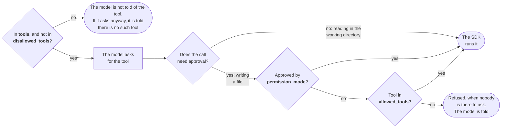

# May this call run?

The questions the SDK asks about a tool, in order, with the option
that answers each. The first is asked once, when the session starts.
The rest are asked every time the model wants a tool used.

- The first attempt went as far as the last question and was refused:
  the call needed approval, the mode did not give it, and no rule
  allowed it.

- The second attempt took the same path and was approved at the last
  question, by `allowed_tools`.

- A mode that approves edits answers one question sooner, and a tool
  on the deny list never gets past the first.

- The picture leaves out two things that later workshops add: a
  function of your own that is asked in place of the refusal, and
  hooks, which are code of yours that runs before any of this.
