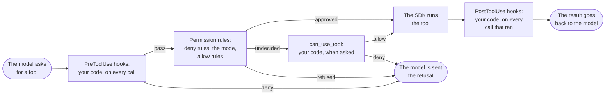

# Before a tool runs, and after

What the SDK does between the model asking for a tool and the model
being sent the result. Your own code can stand in three places: the
two kinds of hook, and the callback.

- A `PreToolUse` hook comes first, before any permission rule is
  looked at. It sees every call the model makes, whatever the mode
  and whatever has been approved ahead of time, and a hook that
  denies ends the matter.

- The permission rules come next: tools taken away with
  `disallowed_tools`, the permission mode, and tools approved with
  `allowed_tools`. Most calls are settled here and go no further.

- The callback is last, and is asked only about a call the rules left
  undecided. A call that was approved by the rules never reaches it.

- A `PostToolUse` hook runs after a tool has run. It sees what was
  asked for and what came back. A call that was refused never ran, so
  it is not seen here.
