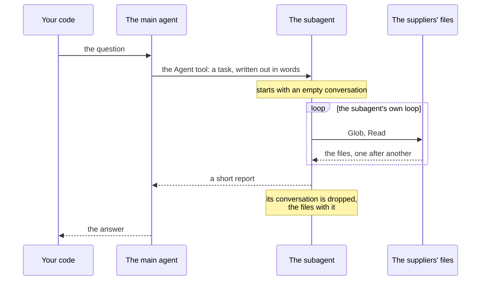

# A subagent at work

One question, answered by a main agent that hands the reading to a
subagent. Time runs down the page.

- The main agent starts the subagent by asking for a tool, `Agent`,
  like any other. What it passes is a task in plain words. That text
  is all the subagent is told: it does not see the main conversation.

- The subagent runs an agent loop of its own, with its own
  instructions and its own tools. The files it reads join its
  conversation, not the main one.

- What comes back to the main agent is the result of the tool call:
  the subagent's last message, its report.

- The main conversation ends up holding the question, the task, the
  report and the answer.
