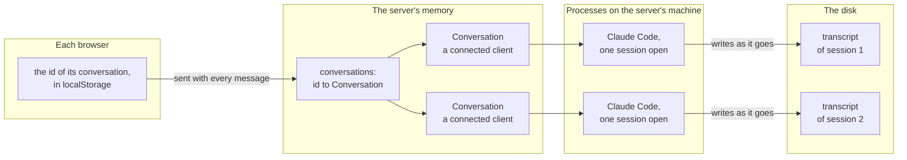

# What is kept where

Two visitors, each with a conversation, and the four places that hold
a part of it.

- The browser keeps one small thing: the id. It never holds the
  conversation, only what it has drawn of it.

- The server's memory holds what is live. A `Conversation` is a
  client and a lock, and the client is a line to a process.

- Each process is a copy of Claude Code with one session open. It is
  what a quick second message costs: a process waiting.

- The transcript on disk is the conversation itself. The route for
  what was said reads it, and a client connected with `resume` starts
  from it. Lose everything to its left and the conversation is still
  there.
