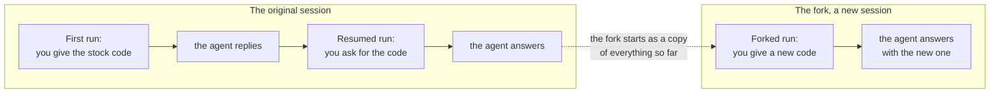

# Resume and fork

Three runs and the two sessions they left. Each box is a message kept
in a session's transcript.

- The first run made the session and ended. Nothing was running
  between it and the next run. The session was a file on disk.

- The resumed run added to that same session: two more messages, under
  the same id.

- The forked run made a second session, with an id of its own, that
  began as a copy of the first. What was said in the fork stayed in
  the fork.

- The original can still be resumed or forked again. Forking is how
  to try two ways forward from one point.
