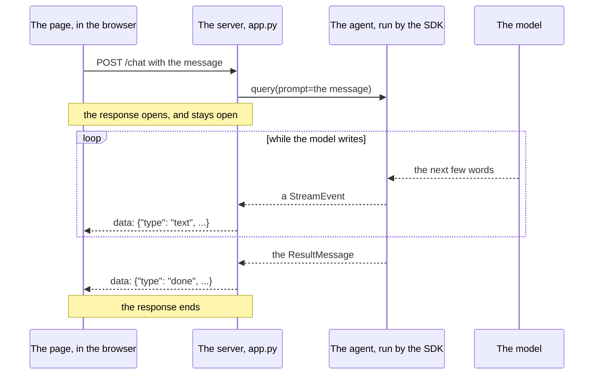

# A streamed reply

One message and its reply, now that the reply is streamed. Time runs
down the page.

- There is still one request and one response. What changed is that
  the response is sent a piece at a time, and takes as long as the
  run.

- Each `StreamEvent` that carries text becomes one `data:` line. The
  page adds its words to the bubble and waits for the next.

- When the agent uses a tool there is a gap in the middle of the
  loop: nothing is being written, so nothing is sent.

- The `ResultMessage` still ends the run. The route turns it into a
  `done` event, its function finishes, and FastAPI closes the
  response.
