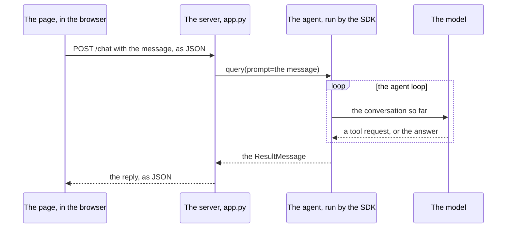

# The three pieces of a chat application

What happens between a message being sent and its reply appearing.
Time runs down the page.

- The page and the server talk in HTTP, as any web page and server
  do. The page sends a request, and the server answers it.

- The server and the agent are one Python program. The server calls
  `query()` as a script would, and waits for the run to end.

- The agent loop is the one you know: the model is sent the
  conversation, asks for a tool or answers, and the SDK carries out
  the tools. None of it is visible to the page, which waits for one
  response to its one request.
