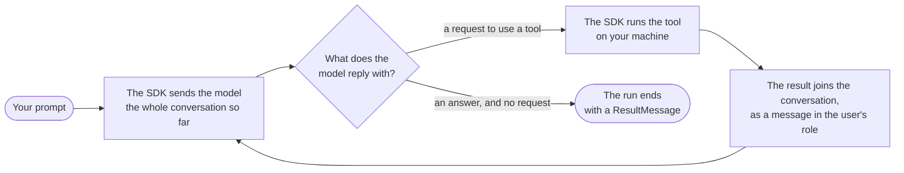

# The agent loop

One run, from the prompt to the result. The loop is the part that goes
round: the model asks, the SDK does, and the model is asked again.

- The model is only ever asked one thing: here is the conversation so
  far, what comes next? It replies with a request to use a tool, or
  with an answer.

- A request is carried out by the SDK, on your machine. The model
  waits for nothing and runs nothing.

- The result is added to the conversation and everything is sent
  again. The model keeps nothing between requests, so each request is
  larger than the one before.

- Nothing in the loop decides how many times it goes round. It ends
  when the model replies without asking for anything, or when a limit
  you set stops it.
