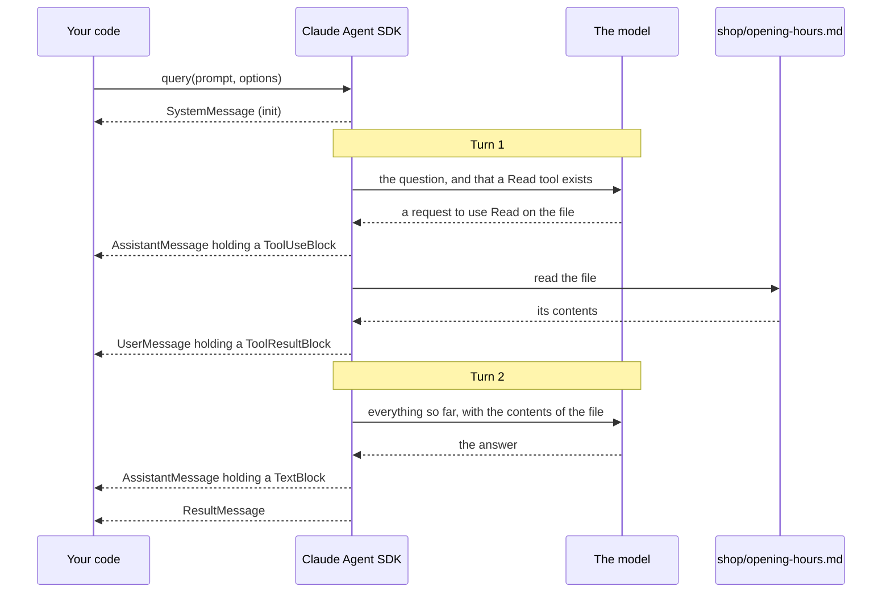

# A run with one tool

The run you just made, step by step. Time runs down the page. A solid
arrow is a request, and a dashed arrow is what comes back.

- The model is asked twice. The first time it replies with a request,
  not an answer. The second time it has the file's contents in front of
  it and can answer.

- The model never reads the file. The SDK does, on your machine, and
  passes the contents on as text.

- The second request carries everything so far: the question, the
  model's own request, and the tool's result. The model keeps nothing
  between the two, so the SDK sends it all again.

- Your code sees each step as a message, in the order shown down the
  left.
