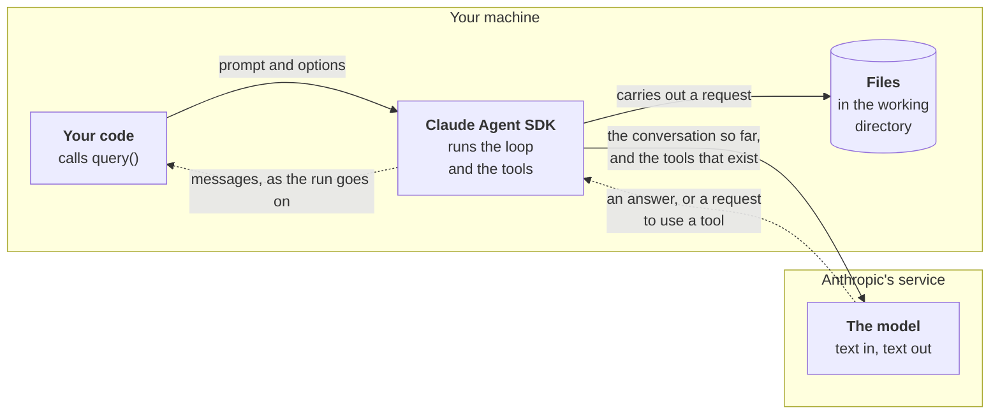

# The pieces of an agent

Three of the pieces are on your machine. The model is not: it is a
service, reached over the network with your Claude login. A solid
arrow is a request, and a dashed arrow is what comes back.

- **Your code** starts a run with a prompt and options, and reads the
  messages that come back.

- **The Claude Agent SDK** is the program around the model. It sends
  the model the conversation, carries out any tool the model asks for,
  sends back what the tool found, and repeats until the model answers.
  Underneath, it runs Claude Code as a separate process to do this.

- **The model** only ever sees text and only ever produces text. It
  never touches your files. It can ask, and the SDK decides whether to
  do what it asks.

- **Files** are reached by tools, and only by the tools the options
  give the agent.
